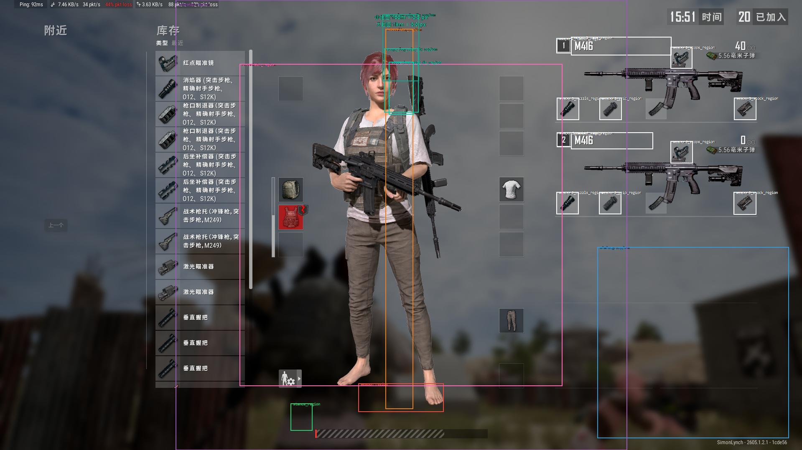

# 使用说明

本文介绍 PUBGAssistance 主程序的使用方法。主程序窗口分为四个选项卡：`地图点位`、`启动助手`、`校准区域`、`按键设置`。

## 1. 使用前准备

### 1.1 推荐游戏环境

- 建议使用 Windows 11。
- 建议游戏分辨率为 `1920x1080`。
- 建议游戏语言使用中文，方便武器名称和装备栏识别。
- 如果更换分辨率、缩放比例、游戏 UI 比例或显示器，需要重新校准区域。

### 1.2 程序文件要求

- 主程序需要和 `config.json`、`templates` 文件夹放在同一项目目录中。
- `config.json` 用于保存校准区域、快捷键、色盲模式、标点颜色等配置。
- `templates` 文件夹用于保存武器、配件、标点等识别模板，不建议随意删除或改名。

## 2. 首次使用流程

第一次使用时，建议先完成校准，再开启辅助功能。

### 2.1 游戏内设置

如下的游戏内设置必须完成，不完成则无法使用本助手内的功能

1. 游戏内 设置->游戏玩法->武器装备栏->选择禁用，可以看到血条上方有武器图标了
2. 游戏内 设置->游戏玩法->武器装备栏->小地图动态缩放->选择禁用，防止一些助手小地图测距的时候比例尺发生变化
3. 若是繁体中文，请检查你的色盲模式，本助手支持所有色盲模式，但是需要在窗口中进行设置
4. 游戏内 设置->按键设置->战斗，修改开火按键，将开火按键选择为end（或者其他自定义特殊按键，则需要在助手按键设置选项卡中修改），这样在M16A4、MK47连点的时候不会出现逻辑错误
5. 确保你的F1~F4按键按下不会触发一些系统指令
6. 确保你的游戏显示模式使用全屏或无边框全屏，保证截图区域位置稳定。

### 2.2 界面介绍

+ 程序运行之后，会出现一个位于屏幕左上角的半透明主窗口、一个左下角的状态栏，开启测距之后会出现测距显示层。
+ 半透明主窗口
  + 主窗口最上端有四个选项卡，右侧红色圆点可以关闭程序，点击`home`键可以显示/隐藏主窗口，隐藏后，左下角状态 HUD 和已开启的辅助功能仍会继续工作。
  + 地图选择选项卡中可选择当前使用地图、显示地图标点的大小、色盲模式、隐藏部分标点
  + 启动助手中可通过按钮开启`武器识别`、`测距显示`、`辅助压枪`（和快捷键作用相同），下面两个调试按钮用于调试特殊武器与压枪参数，最下方按钮可查看特殊助手的启用情况（开启测距显示后会自动识别武器并开启，无需通过按钮手动开启）
  + 区域校准用于进行区域框的校准，后续详细说明
  + 按键设置用于设置可自定义的快捷键，后续也详细说明
+ 左下角状态栏
  + 左下角状态栏恒定显示武器识别、测距显示、辅助压枪是否开启（文字绿色开启，红色关闭）、装备栏是否打开。第二三行为当前装备栏中识别到的主武器、配件等。第四行为当前手持武器、当前姿势。
+ 测距显示层
  + 开启测距显示层后，状态栏上方会显示当前使用标点，用于一些特殊助手（手雷瞬爆、C4冲锋等）的自动操作。
  + 开启测距显示层后，小地图右上端会显示两排标点，上排为大地图测距数据，下排为小地图测距数据

### 2.2 区域校准顺序（必做）

1. 启动游戏并进入训练场或对局。启动程序，进入 `校准区域`。
2. 可先点击`显示所有校准区域框`，查看各区域位置是否匹配，若不匹配则需分别按下下方的7*3个按钮进行区域的框选校准，校准时左键从一个位置拖动到另一个位置完成校准，若误触校准按钮，鼠标右键可以取消。
3. 每个区域框在满足必须的校准原则的前提下，框越小计算速度越快，每个框的校准原则如下：
   1. 小地图/大地图：按N打开小地图。按M打开大地图，需要找到地图的真实边界，从左上角拖动到右下角。校准程序中会强制拖动成正方形，因此左上角点要找准，右下角找准一个边即可。（需注意，小地图外侧可能有一点外轮廓，莫要将外轮廓框到区域内，以免测距不准）
   2. 1km比例尺（不是框，是一条线）：需要打开大地图，缩放到平时迫击炮测距最舒服、最习惯的缩放比例，然后从地图上1km正方形的一个边的起点拖到终点，标定大地图中1km的真实屏幕距离。以后迫击炮大地图测距的时候必须用当前的缩放比例。
   3. 武器1编号/武器2编号：打开装备栏（tab）后，右侧两个主武器的武器名称左边分别有一个方框1和方框2，将此框框住（大小需要比外侧白框大一个像素，如果不知道有没有框好，可按下tab看一下左下角状态栏中是否显示"武器识别中..."）
   4. 武器1名称/武器2名称：比两个主武器的名称略大一些即可，框好后需要在`调试缩放比例`中校准缩放比例，才能确保正常识别，此步骤后续会详细说明
   5. 武器1倍镜/武器2倍镜/武器1枪口/武器2枪口/武器1握把/武器2握把/武器1枪托/武器2枪托：分别选择对应的区域框即可，需要注意的也是大小比外侧白框大一个像素，如果不知道有没有框好，可按下tab调出武器看一下有没有识别到对应的配件（前提是武器名称能正常识别）
   6. 武器图标：按照 2.1游戏内设置 关闭了武器装备栏后，可以看到人物血条上方的武器图标，此区域需要比该图标大一点即可。框好后需要在`调试缩放比例`中校准缩放比例
   7. 姿势区域：开第一人称后，人物血条的左边有显示姿势，框选该区域，保证站立、蹲着、趴下均在此框内。框好后需要在`调试缩放比例`中校准缩放比例
   8. 垂直测高：屏幕中间的一笑竖长条，用于迫击炮测距高度补偿，宽度大概大概就行，注意上端不要选到顶部罗盘中，否则会识别到罗盘上的标点
   9. 四倍镜内边/六倍镜内边/八倍镜内边：打开各倍镜，找到倍镜内框边界，框选其在上方的区域。确保其内框在呼吸晃动的过程中不要上下超出框外即可，四倍镜和六倍镜注意不要框到倍镜的外框边缘（框内最上端保持是黑色即可）
4. 完成后重启助手，让所有配置稳定生效。

### 2.4 缩放校准窗口

如果你发现模板识别不稳定，进入 `校准区域` 点击 `打开缩放校准窗口`。
- 缩放校准窗口用于校准截图区域的 XY 缩放比例。需要选择待校准的区域（四个区域均需校准，而不是选一即可）
- 调出该区域内的图标（武器名称需打开装备栏，捡起两把可识别的主武器，武器图标需退出装备栏，手持该武器，姿势区域切换第一人称即可）。需注意，武器图标校准时最好背景干净、偏黑一点，当然只要别太杂乱就行，否则有极小概率匹配分数过低。
- 选择与当前所匹配的模板，在右侧可以获得预览，模板与缩放后的截图大小尺寸、比例越相像则匹配结果越好，具体匹配结果数值在匹配分数栏中显示，该分数越大越好。
- 点击“自动寻找XY缩放比例”可以进行自动寻找匹配分数最大的组合，或者手动拖动缩放滑块寻找，或者直接输入缩放数值也可。
- 点击保存
- 依次校准完四个缩放比例，可以调出武器、姿势进行测试，识别效果好的话则校准完成。

### 2.5 压枪参数校准（非必须）

如果发现压枪效果不好，则可以自行校准压枪参数。点击启动助手选项卡->调试压枪参数。选择你要校准的枪和其配件（推荐先校准无配枪，再一个一个添加配件校准！倍镜用红点/全息即可，不影响）
+ 在游戏中选择枪械，窗口中选择同样的枪械，按`F3`开启/关闭压枪，需注意，每次调试一轮参数前后都要记得开启/关闭，否则要么把参数点拖到贼下面，要么没开压枪。
+ 拖动右侧的曲线点，可修改在横坐标对应时间的压枪力度/配件的力度修正系数，该规律自己摸索即可。
+ 每次修改完参数后，记得保存。点击保存后会自动加载到当前的参数，并且会保存在配置文件中
+ 校准压枪时确保你是在站立的姿势下，不要蹲下或趴下

### 2.6 特殊武器校准（非必须）

如果发现特殊武器瞄准/辅助效果不好，则可以自行校准特殊武器。点击启动助手选项卡->调试特殊武器。校准的思路一看就懂，不想写了。

## 3. 日常使用流程（接下来都是 AI 写的，看看得了）

### 3.1 标准启动步骤

1. 启动游戏并进入对局。
2. 启动助手主程序。
3. 在 `地图点位` 中选择当前地图、标点大小、色盲模式和点位类型。
4. 在 `启动助手` 中开启 `武器检测`。
5. 按 `Tab` 打开游戏装备栏，让助手识别两把主武器和配件。
6. 关闭装备栏，助手会根据当前手持武器更新左下角状态 HUD。
7. 根据需要开启 `瞄准辅助` 和 `辅助压枪`。

### 3.2 推荐使用习惯

- 每次换枪、换配件后，按 `Tab` 打开装备栏让助手重新识别。
- 需要迫击炮、投掷物、火箭筒、VSS、十字弩、C4 等显示层时，先开启 `瞄准辅助`。
- 需要压枪时，先确认 `武器检测` 已开启，并且左下角显示的当前武器正确。
- 如果进入新地图，先到 `地图点位` 切换地图，否则点位显示可能不匹配。

## 4. 地图点位选项卡

`地图点位` 用于控制地图、地图点位大小、色盲模式和点位类型。

### 4.1 选择地图

当前支持以下地图：

- `艾伦格`
- `米拉玛`
- `泰戈`
- `荣都`
- `帝斯顿`
- `维寒迪`

选择地图后，地图点位助手会按当前地图加载对应点位。

### 4.2 标点尺寸

- `小`：点位图标较小，适合不想遮挡大地图时使用。
- `中`：默认推荐大小，兼顾清晰度和遮挡。
- `大`：点位图标更明显，适合快速找点。

### 4.3 色盲选择

色盲模式会同时影响标点识别和 HUD 显示颜色。

- `无色盲`：游戏未开启色盲模式时使用。
- `绿色盲`：游戏开启绿色盲模式时使用。
- `红色盲`：游戏开启红色盲模式时使用。
- `蓝色盲`：游戏开启蓝色盲模式时使用。

如果小地图、大地图或垂直测高识别不到标点，优先检查这里是否和游戏内色盲设置一致。

### 4.4 点位类型

可以单独开启或关闭以下点位类别：

- `载具`：显示车辆刷新点。
- `飞机`：显示飞机、滑翔机等相关点位。
- `密室`：显示密室、特殊房间等点位。
- `其他`：显示熊洞、撬棍房、实验室、安全门等其他特殊点位。

### 4.5 显示地图点位

- 当前没有识别到手持武器时，按住 `鼠标左键 + 鼠标中键` 会显示当前地图点位。
- 松开按键后点位可继续显示，按 `鼠标右键` 可以关闭点位显示。
- 如果按住 `Alt` 再按右键，程序不会关闭点位显示，方便保留游戏内路线标记操作。
- 如果助手识别到当前手持武器，地图点位助手会自动关闭，避免影响战斗显示。

## 5. 启动助手选项卡

`启动助手` 用于开启核心功能和特殊武器助手。

### 5.1 武器检测

- 点击 `开启武器检测` 或按 `F1` 开启。
- 开启后，助手会启用装备栏识别、手持武器识别、姿势识别等基础能力。
- 关闭后，当前武器会被清空，压枪和自动特殊武器助手会失去基础识别信息。
- 日常使用建议保持开启。

### 5.2 瞄准辅助

- 点击 `开启瞄准辅助` 或按 `F2` 开启。
- 开启后，小地图测距、垂直测高、大地图测距显示层、迫击炮和特殊武器 HUD 才会显示。
- 关闭后，迫击炮、火箭筒、投掷物、VSS、十字弩、C4 等显示层会关闭。
- 如果你发现特殊武器助手不显示，先检查 `瞄准辅助` 是否开启。

### 5.3 辅助压枪

- 点击 `开启辅助压枪` 或按 `F3` 开启。
- 开启后，助手会根据当前武器、配件和姿势计算压枪力度。
- 压枪适用于常规枪械和部分连狙，不适用于火箭筒、投掷物、VSS、十字弩、C4 等特殊武器。
- 使用前建议先打开装备栏识别当前两把武器和配件。
- 射击时助手会冻结武器识别结果，避免开火抖动导致当前武器被短暂清空。

### 5.4 重新加载压枪配置

- 点击 `重新加载压枪配置` 可以重新读取压枪参数。
- 如果你手动修改过压枪配置，或者压枪力度异常，可以尝试点击此按钮。
- 点击后不需要重启主程序。

### 5.5 特殊武器助手开关

特殊武器助手包括：

- `迫击炮`
- `火箭筒`
- `投掷物`
- `VSS`
- `十字弩`
- `C4`

使用规则：

- `瞄准辅助` 未开启时，手动点击特殊武器按钮不会真正启用对应助手。
- `瞄准辅助` 开启后，助手会根据当前识别到的武器自动启用对应特殊武器助手。
- 你也可以手动点击某个特殊武器按钮，临时强制开启或关闭对应助手。
- 关闭 `瞄准辅助` 后，手动开启状态会被清空。

## 6. 按键设置选项卡

`按键设置` 用于查看和修改快捷键。

### 6.1 默认快捷键

| 功能 | 默认快捷键 | 说明 |
| --- | --- | --- |
| 显示 / 隐藏主窗口 | `Home` | 固定快捷键，不在按键设置里修改。 |
| 武器检测开关 | `F1` | 开启或关闭基础识别。 |
| 辅助显示开关 | `F2` | 开启或关闭瞄准辅助显示层。 |
| 辅助压枪开关 | `F3` | 开启或关闭辅助压枪。 |
| 大地图测距 | `F4` | 进入大地图点击测距流程。 |
| 手雷瞬爆 | `B` | 当前手持手雷且显示层开启时使用。 |
| 打开装备栏 | `Tab` | 通知助手开始装备栏识别。 |
| 标点向前切换 | `Q` | 切换到上一个标点颜色。 |
| 标点向后切换 | `E` | 切换到下一个标点颜色。 |
| 地图点位显示 | `鼠标左键 + 中键` | 只读显示，不能在界面内修改。 |

### 6.2 修改快捷键

1. 进入 `按键设置`。
2. 找到要修改的功能。
3. 点击右侧 `录制`。
4. 按下新的快捷键。
5. 确认界面显示的新快捷键正确。
6. 点击底部 `保存快捷键`。

### 6.3 恢复默认快捷键

- 点击 `恢复默认` 会把可配置快捷键恢复为默认值。
- 恢复后程序会重新加载监听器。
- 如果快捷键和游戏按键冲突，建议优先修改助手快捷键。

### 6.4 快捷键注意事项

- `Home` 用于隐藏或显示主窗口，当前不在按键设置里修改。
- `地图点位显示` 固定为 `鼠标左键 + 中键`，界面中只显示，不提供录制按钮。
- `N` 当前也可以快速切换瞄准辅助，但主要推荐使用可配置的 `F2`。
- 修改快捷键后，如果出现无响应，可以点击 `保存快捷键` 或重启助手。

## 7. 大地图测距

大地图测距用于计算玩家当前位置到四个颜色标点的距离。

### 7.1 使用步骤

1. 在游戏中打开大地图。
2. 确认 `瞄准辅助` 已开启。
3. 按 `F4` 进入大地图测距模式。
4. 屏幕会提示 `请左键点击你的当前位置`。
5. 用鼠标左键点击你在大地图上的当前位置。
6. 助手会自动寻找黄、橙、蓝、绿四个标点，并计算距离。
7. 测距结果会显示在屏幕显示层中。

### 7.2 使用注意事项

- 大地图测距依赖 `校准大地图` 和 `校准1km长度`。
- 如果距离明显不准，优先重新校准大地图区域和 1km 长度。
- 如果某个颜色没有打标点，对应颜色可能不显示或显示为空。
- 如果游戏内色盲模式改变，需要同步修改助手 `色盲选择`。

## 8. 特殊武器助手

特殊武器助手通常需要同时满足两个条件：`瞄准辅助` 已开启，并且当前武器识别正确。

### 8.1 迫击炮

- 先在地图上给目标打标点。
- 开启 `瞄准辅助`。
- 迫击炮助手会显示各颜色标点距离信息。
- 根据目标标点颜色选择对应距离，再调整迫击炮射击距离。
- 如果距离不显示，检查小地图标点是否可见、色盲模式是否正确、小地图区域是否校准准确。

### 8.2 火箭筒

- 手持火箭筒后，助手会自动启用火箭筒 HUD。
- 先给目标打标点。
- 屏幕会显示辅助标尺，提示不同距离下需要抬高的瞄准高度。
- 按标尺抬高准星后再发射。
- 建议使用第一人称腰射，不要开镜，以保证标尺位置符合预期。

### 8.3 投掷物

- 手持投掷物后，助手会自动启用投掷物 HUD。
- 先给目标打标点。
- 屏幕会显示抛物线辅助标尺，按目标距离选择对应抬高线。
- 当前手持手雷且 `瞄准辅助` 开启时，按 `V` 可以触发自动瞬爆流程。
- 自动瞬爆会根据当前标点距离控制拉环和投掷时机，使用前请确认距离识别准确。

### 8.4 VSS

- 手持 VSS 后，助手会自动启用 VSS HUD。
- 给目标打标点后，屏幕会显示对应距离的下坠参考线。
- 根据横线位置抬高准星进行射击。

### 8.5 十字弩

- 手持十字弩后，助手会自动启用十字弩 HUD。
- 给目标打标点后，根据屏幕上的横线参考箭矢下坠。
- 十字弩标尺以中心左右对称的横线为主，不使用白色竖线。

### 8.6 C4

- 手持 C4 后，助手会自动启用 C4 助手。
- 按住鼠标左键安装 C4，安装过程中会显示安装提示。
- 安装完成后，HUD 会显示爆炸倒计时、建议车速和当前使用标点。
- 按 `Q` 或 `E` 可以切换当前目标标点颜色。
- 当建议车速达到合适范围时，HUD 会提示推荐起步。
- 当距离目标过近时，HUD 会提示推荐跳车。

## 9. 压枪功能

### 9.1 使用步骤

1. 开启 `武器检测`。
2. 打开装备栏，让助手识别两把武器和配件。
3. 关闭装备栏，确认左下角 `当前` 武器显示正确。
4. 开启 `辅助压枪`。
5. 正常按住开火键射击。

### 9.2 影响压枪力度的因素

- 当前手持武器。
- 当前倍镜。
- 当前握把。
- 当前枪口。
- 当前枪托。
- 当前姿势，包括站立、蹲下、趴下。

### 9.3 压枪异常排查

- 如果压枪不生效，检查 `识别` 和 `压枪` 是否都是开启状态。
- 如果压枪力度不对，重新打开装备栏识别配件。
- 如果姿势影响不正确，重新校准 `姿势区域`。
- 如果换枪后仍按旧武器压枪，打开装备栏重新识别。
- 如果手持特殊武器，压枪会自动不生效，这是正常现象。

## 10. 常见问题

### 10.1 按快捷键没反应

- 确认游戏窗口处于前台。
- 确认助手没有正在录制快捷键。
- 进入 `按键设置` 检查快捷键是否被改动。
- 点击 `恢复默认` 后再测试。
- 如果仍无效，重启助手。

### 10.2 标点识别不到

- 检查游戏内是否真的打了黄、橙、蓝、绿标点。
- 检查助手 `色盲选择` 是否和游戏内色盲模式一致。
- 重新校准 `小地图`、`大地图` 或 `垂直测高`。
- 避免地图被其他窗口、录屏浮层或游戏 UI 遮挡。

### 10.3 武器或配件识别错误

- 打开装备栏后等待左下角状态从 `武器识别中` 变为稳定结果。
- 重新校准武器名称、编号和配件区域。
- 确保游戏语言为中文。
- 确保装备栏区域没有被其他浮窗遮挡。

### 10.4 大地图测距不准

- 重新校准 `大地图`。
- 重新校准 `1km长度`。
- 确认当前游戏地图和助手 `地图点位` 里选择的地图一致。
- 确认点击的是玩家当前位置，而不是目标点。

### 10.5 地图点位不显示

- 确认当前没有识别到手持武器。
- 按住 `鼠标左键 + 鼠标中键` 触发显示。
- 检查是否选择了正确地图。
- 检查点位类型是否被全部关闭。
- 如果已显示但想关闭，按 `鼠标右键`。

### 10.6 特殊武器助手不显示

- 确认 `瞄准辅助` 已开启。
- 确认 `武器检测` 已开启。
- 确认左下角 `当前` 武器识别正确。
- 检查 `启动助手` 中对应特殊武器按钮是否处于开启状态。

## 11. 建议使用顺序速记

日常最推荐的顺序如下：

1. 进入游戏。
2. 启动助手。
3. 选择地图和色盲模式。
4. 按 `F1` 开启武器检测。
5. 按 `Tab` 打开装备栏识别武器和配件。
6. 按 `F2` 开启瞄准辅助。
7. 按 `F3` 开启辅助压枪。
8. 需要大地图测距时按 `F4`。
9. 需要切换目标标点时按 `Q` 或 `E`。
